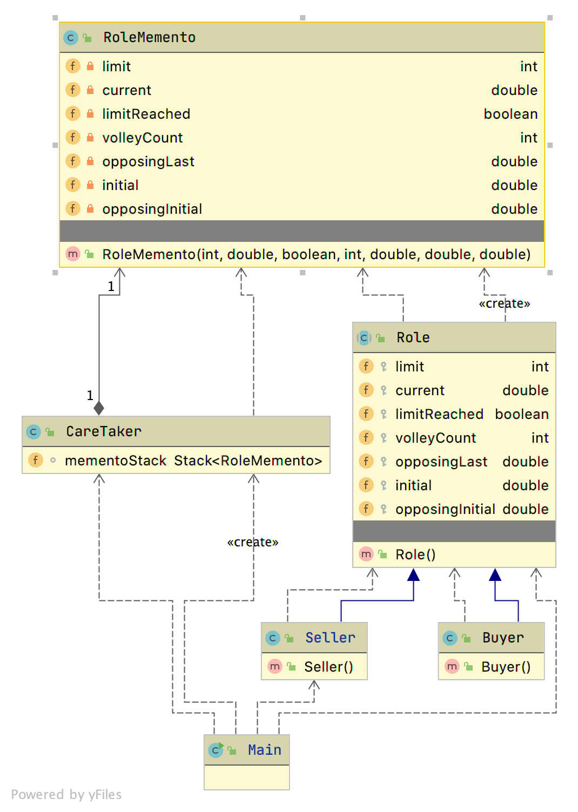

# Project Description

This project is an application to assist the user in haggling. It helps buyers buy low and sellers sell high. It is useful for yard sales, real estate, insurance, business, and even government.
This release is optimized for an insurance claims negotiation. The software design pattern that we did not study and that I have used in my project is the memento pattern. I also used the factory method in my project.

The use case of memento pattern here is the undo feature in the console based user interface. The application promts the user to chose a role: either buyer or seller. If the user is the seller they must enter a starting price. The user is then prompted to enter the other party's counter offer amount and suggests what the user's optimal next counter amount should be. After each exchange, the user can press "u" to undo and application will undo the last exchange. 

My primary design goal was to create a way for a user to perform an undo action. I have achieved that goal through the memento pattern. Another goal is flexibility. Memento pattern also supports that goal as the memento and care taker classes could be used with a GUI or other client code. In this release the client code is the main class which contains the console user interface logic.

I have avoided duplicated code through inheritance and polymorphism. Most of the code for the buyer and seller objects is in the abstract superclass Role. Buyer and Seller classes inherit from that and implement their own unique move() algorithms.

The focus of this project is the memento pattern. The core negotiating algorithm works but
is a work in progress. For best results a suggested start for buyer and seller is one in which the buyer's staring offer is about 10 % of the seller's initial asking price. That spread is typcial of an insurance claim settlement negotiation or a congressional budget negotiating. In the recent covid stimulus negotiation one party started at 950 billion and the other at 150 billion. 

# running application

Application can be ran from the main method in Driver.java in edu.bu.met.cs655 package.
If you chose to be the buyer, a suggested input for buyer starting price is 10000 with a limit of 7000
If you chose seller the suggested limit is 3000 and the suggested counterparty's first offer is 10000 .
at or around those figures, the suggested counterparty's amounts should move 3-500 increments. 
The application works with other figures but those will give you a good sampling of it in action.

# Github Link

[link to my final project Github repo](https://github.com/metcs/met-cs665-assignment-project-pmcder.git)

# UML




# How to compile the project

We use Apache Maven to compile and run this project. 

You need to install Apache Maven (https://maven.apache.org/)  on your system. 

Type on the command line: 

```bash
mvn clean compile
```

# How to create a binary runnable package 


```bash
mvn clean compile assembly:single
```


# How to run

```bash
mvn -q clean compile exec:java -Dexec.executable="edu.bu.met.cs665.Main" -Dlog4j.configuration="file:log4j.properties"
```

We recommend the above command for running the project. 

Alternativly, you can run the following command. It will generate a single jar file with all of the dependencies. 

```bash
mvn clean compile assembly:single

java -Dlog4j.configuration=file:log4j.properties -classpath ./target/JavaProjectTemplate-1.0-SNAPSHOT-jar-with-dependencies.jar  edu.bu.met.cs665.Main
```


# Run all the unit test classes.


```bash
mvn clean compile test

```

# Using Findbugs 

To see bug detail using the Findbugs GUI, use the following command "mvn findbugs:gui"

Or you can create a XML report by using  


```bash
mvn findbugs:gui 
```

or 


```bash
mvn findbugs:findbugs
```


For more info about FindBugs see 

http://findbugs.sourceforge.net/

And about Maven Findbug plugin see 
https://gleclaire.github.io/findbugs-maven-plugin/index.html


You can install Findbugs Eclipse Plugin 

http://findbugs.sourceforge.net/manual/eclipse.html


SpotBugs https://spotbugs.github.io/ is the spiritual successor of FindBugs.


# Run Checkstyle 

CheckStyle code styling configuration files are in config/ directory. Maven checkstyle plugin is set to use google code style. 
You can change it to other styles like sun checkstyle. 

To analyze this example using CheckStyle run 

```bash
mvn checkstyle:check
```

This will generate a report in XML format


```bash
target/checkstyle-checker.xml
target/checkstyle-result.xml
```

and the following command will generate a report in HTML format that you can open it using a Web browser. 

```bash
mvn checkstyle:checkstyle
```

```bash
target/site/checkstyle.html
```


# Generate  coveralls:report 

You can find more info about coveralls 

https://coveralls.io/

```bash
mvn -DrepoToken=YOUR-REPO-TOCKEN-ON-COVERALLS  cobertura:cobertura coveralls:report
```


